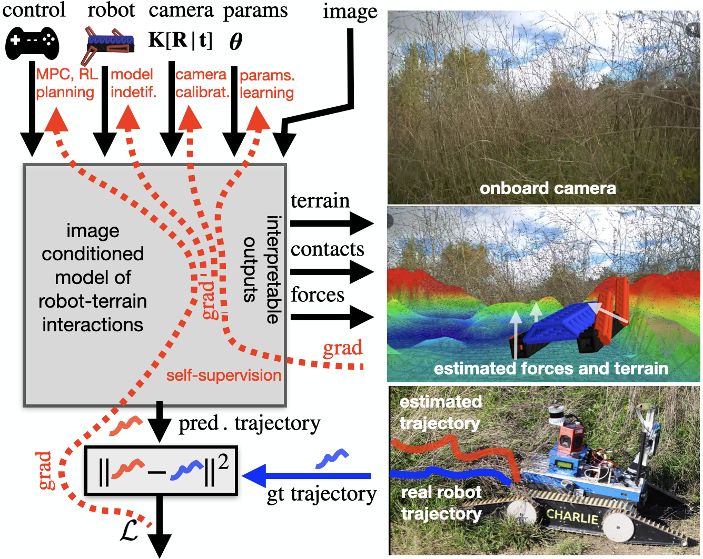

# Differentiable Simulation

Differentiable robot-terrain interaction model for a tracked robot written
using [NVIDIA-Warp](https://nvidia.github.io/warp/).



## Running

To train Terrain Encoder model with the L2-loss
computed between predicted (by Differentiable Physics)
and ground truth trajectories, run:

```bash
python terrain_optimization
```

### Weights

The pretrained weights for the [LSS](https://github.com/nv-tlabs/lift-splat-shoot)
Terrain Encoder can be downloaded from:
- RobinGas: [lss_robingas_husky.pt](https://drive.google.com/file/d/1h1VieiIdGZB1Ml3QdIlh8ZJA67sJej4m/view?usp=sharing),
            [lss_robingas_tradr.pt](https://drive.google.com/file/d/1jpsgXN-44Bbu9hfAWd5Z3te1DWp3s8cX/view?usp=sharing),
            [lss_robingas_husky_oru.pt](https://drive.google.com/file/d/12v6EAvaw0LqdINYFyHYr0t5mlZn-VN6c/view?usp=sharing),
- RELLIS-3D: [lss_rellis3d.pt](https://drive.google.com/file/d/1kK75mUxHn-4GadU4k8-c43hA9t3bZxw1/view?usp=sharing).

Once downloaded, please put the weights to `config/weights/` folder.
